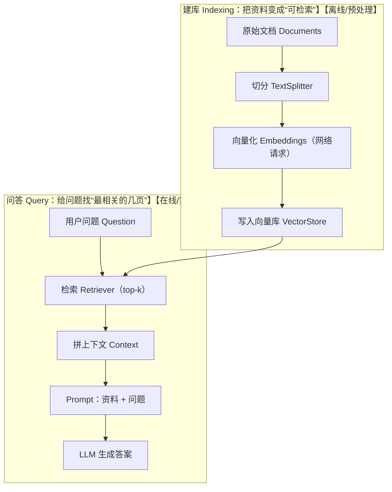

# Day 3：拆解 RAG

**RAG 就像开卷考试。**

大模型本身像个很聪明、但记忆可能不准的同学；RAG 的做法是：

1) 先去“资料库”里翻到最相关的几页（检索）
2) 把这几页放到题目旁边

# 把「检索」升级成“可控、可解释、可复用”的 RAG 流程

**从“能跑的 demo”，走向“像样的 RAG pipeline”。**，探究：

1. ✅ 为什么必须切分文档（chunk）
2. ✅ TextSplitter 是干嘛的（怎么切才不瞎切）
3. ✅ Retriever 是什么（比 similaritySearch 更适合写成流程）
4. ✅ 用 Prompt 把「资料 + 问题」正确喂给模型（不然你以为是 RAG，其实是“裸问”）

对应可跑代码在 [src/RAG/day3/index.ts](./index.ts)。

---

## 一、为什么 Day 2 的代码“还不够 RAG”

Day 2 往往长这样：问题 → 向量搜索 → 把结果丢给模型。

看起来像 RAG，但一上强度就会暴露问题：

- 文档一大（几千字、几万字）怎么办？
- 命中“一整篇”，但其实只有其中一段有用
- embedding 会把多个主题糊在一起，检索变不准
- 上下文太长，token 成本直接爆炸

所以 Day 3 的核心升级点就一句话：

**先把资料拆成“语义块”，再做检索和喂给模型。**

---

## 二、RAG 的两段路：建库（Indexing）+ 问答（Query）



你会发现：Day 2 往往只做了 Query 的一半；Day 3 是把 Indexing 和 Query 都做完整。

---

## 三、为什么必须切 chunk？

**embedding 不是给“整篇文章”用的，是给“一个语义块”用的。**

目的是让每个 chunk 满足：

- 一块基本只讲一个点（不糊）
- 但也别短到缺上下文（不碎）

切分文本：

```ts
const splitter = new RecursiveCharacterTextSplitter({
  chunkSize: 200,
  chunkOverlap: 40,
});
```

怎么解释这俩参数最通俗：

- `chunkSize`：每页大概多长
- `chunkOverlap`：翻页时把页尾抄到下一页一点点（避免一句话被腰斩）

---

## 四、TextSplitter 到底干嘛的？

最常见、最稳的切分器：

```ts
import { RecursiveCharacterTextSplitter } from "@langchain/textsplitters";
```

它的特点是：**优先在“更合理的边界”切**（比如段落/换行/标点附近），尽量别把一句话硬切断。

在 [src/RAG/day3/index.ts](src/RAG/day3/index.ts) 里，把原始文档先转成 `Document`，再切：

```ts
const splitDocs = await splitter.splitDocuments(
  rawDocuments.map((d) => new Document({ pageContent: d.pageContent, metadata: d.metadata })),
);
```

---

## 五、Retriever：比 similaritySearch 更“流程化”的抽象

按照 Day 2 的思路会直接写：

```ts
await vectorStore.similaritySearch(question, 2);
```

它的问题不是“不能用”，而是：

- 你很难把它当成一个组件去替换/组合
- 写着写着就很难串成 pipeline

Day 3 改成 Retriever 之后，RAG 的“形状”就对了：

```ts
const retriever = vectorStore.asRetriever({ k: 2 });
const relevantDocs = await retriever.invoke(question);
```
---

## 六、Prompt 是灵魂：把“资料 + 问题”正确喂给模型

新手最常犯的错是：

```ts
// 这叫“裸问”，不是 RAG
await model.invoke(question);
```

RAG 正确做法是：**让模型“照资料答题”，资料没有就说不知道。**

抑制幻觉的通用模板：

```
你是一个助手，只能根据以下资料回答问题。
如果资料中没有答案，请回答“我不知道”。

资料：
{{context}}

问题：
{{question}}
```

这个思想体现在 system prompt：

- “必须严格根据上下文回答”
- “没有明确答案就说我不知道”

---

## 七、Day 3 自检清单

1) 为什么不直接对整篇文章 embedding？

2) `chunkSize` 太大会怎样？

3) Retriever 和 similaritySearch 的区别？

4) Prompt 里为什么要强调“只能根据资料回答”？

---

## 八、答案
> 1. 因为整篇会把多个主题混在一起，检索变糊；而且上下文太长、token 成本会爆。
> 2. chunk 里东西太杂，语义被冲淡，检索更不准。
> 3. similaritySearch 是“一个函数调用”；Retriever 是“一个专门找资料的组件”，更适合组合成 RAG 流程。
> 4. 为了抑制幻觉，让回答可追溯到 context。