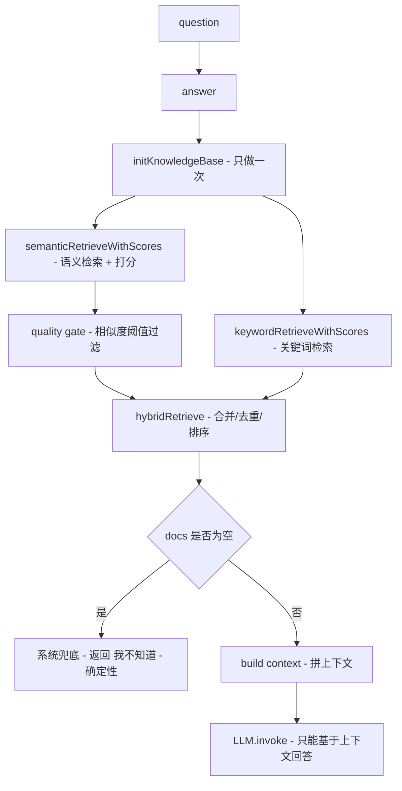

# Day 5：RAG 效果与质量控制（从“能用”到“好用”）

**解决一个真实系统最常见的问题：为什么“检索到了”，却依然回答不好？**

对应可跑代码在 [src/RAG/day5/index.ts](./index.ts)。

---

## 一、Day 5 关注点：检索质量 > 模型大小

Day 4 已经把 RAG 工程化成了一个可调用的流程（init → retrieve → build context → generate）。

但真实系统里更常见的坑不是“检索不到”，而是：

> **Retriever 确实给了 k 条结果，但这些结果不够好 / 不够确定 / 夹杂噪声**

于是模型会：

- 被“看似相关但无用”的 chunk 带偏
- 在“主题相关但答案缺失”的情况下开始合理推测（幻觉）
- 被 README/模板/噪音段落污染上下文

Day 5 的核心就是给 RAG 加上**质量闸门（Quality Gate）**和**多路检索（Hybrid Retriever）**，让回答更稳定、更可控、更可信。

---

## 二、Day 5 的最小工程形状（流程图）

把 Day 5 的实现想成一个更“谨慎”的 `answer(question)`：



一句话：**Day 5 不是让模型更聪明，而是让“给模型的上下文”更可靠。**

---

## 三、核心能力一：相似度阈值（Quality Gate）

### 3.1 为什么“低质量上下文”比“没有上下文”更危险？

因为 Retriever 的默认行为是：

> **不管相关不相关，先返回 top-k**

当 top-k 里混进“弱相关/伪相关”的 chunk，模型会被迫在错误前提下继续推理，结果往往比“直接说不知道”更糟。

### 3.2 代码怎么做：先打分，再过滤

Day 5 在 [src/RAG/day5/index.ts](./index.ts) 里用 `similaritySearchWithScore` 拿到了每条候选的相似度分数，然后用阈值做过滤：

```ts
const SIMILARITY_THRESHOLD = 0.35;
const SEMANTIC_TOP_K = 8;

async function semanticRetrieveWithScores(question: string) {
	const results = await vectorStore.similaritySearchWithScore(question, SEMANTIC_TOP_K);
	const candidates = results
		.map(([doc, score]) => ({ doc, score, source: "semantic" }))
		.sort((a, b) => b.score - a.score);

	const passed = candidates.filter((x) => x.score >= SIMILARITY_THRESHOLD);
	return { candidates, passed };
}
```

得到的是两份列表：

- `candidates`：top-k 原始候选（用于观察/调参）
- `passed`：通过质量闸门的候选（用于真正喂给模型）

### 3.3 工程认知：阈值不是拍脑袋

`0.35` 只是演示用的一个起点。阈值在工程里应该通过：

- 日志观察（不同问题的分数分布）
- 人工验收（分数到多少开始“可用”）
- 分模型调整（不同 embedding 模型分布不同）

所以 Day 5 的重点不是“这个数是多少”，而是**必须要有这个闸门**。

---

## 四、核心能力二：关键词检索（弥补向量检索盲区）

### 4.1 为什么需要关键词检索？

向量检索擅长语义相似，但对这些场景可能不敏感：

- 专有名词/字段名：`user_id`
- ID/编号：`user_123`
- 代码 token：`getUserById`

这些内容往往需要**精确命中**。

### 4.2 Day 5 的关键词检索：可解释的小实现

Day 5 没上 BM25/全文索引，而是实现了一个“能看懂的关键词召回”，目的就是把思路讲清楚：

1) 从问题里抽取关键词（包含 `user_\d+`、英文 token、中文片段）
2) 在 chunk 文本里做 `includes` 命中
3) 用命中数 + 词长权重打分

关键代码（简化表达）：

```ts
function extractKeywords(question: string): string[] {
	// 1) user_123
	// 2) user_id / rag / bm25 / getUserById
	// 3) 中文连续串 + 2 字切片（增强命中率）
}

function keywordScore(text: string, keywords: string[]) {
	// 命中则加分；长词（例如 user_123）权重大
}

function keywordRetrieveWithScores(question: string): ScoredDoc[] {
	const keywords = extractKeywords(question);
	return knowledgeChunks
		.map((doc) => ({ doc, score: keywordScore(doc.pageContent, keywords), source: "keyword" }))
		.filter((x) => x.score > 0)
		.sort((a, b) => b.score - a.score)
		.slice(0, KEYWORD_TOP_K);
}
```

会发现它“笨但有用”：

- 解释性强：为什么命中、命中哪些词，一眼能看懂
- 对 `user_id` 这种 token 很灵
- 能作为向量检索的兜底通道

---

## 五、核心能力三：Hybrid Retriever（多路召回 + 合并排序）

### 5.1 思想：多走几条路，再统一裁决

Day 5 的混合检索做了三件事：

1) **语义检索**（并通过阈值过滤）
2) **关键词检索**（精确命中兜底）
3) **合并 + 去重 + 排序**（选 top-k 作为上下文）

### 5.2 合并去重：以 chunk 为单位

实现里用 `docId#chunkIndex` 作为唯一 key，避免“同一 doc 的不同 chunk”被强行合并：

```ts
function keyOf(doc: Document) {
	const m = (doc.metadata ?? {}) as any;
	const id = m.docId ?? m.id ?? "unknown";
	const chunkIndex = m.chunkIndex ?? "?";
	return `${String(id)}#${String(chunkIndex)}`;
}
```

这是一个很工程化的小点：**检索/上下文的单位是 chunk，不是原文档。**

### 5.3 为什么要归一化 + 加权？

语义分数（embedding 相似度）和关键词分数（命中权重）不在同一尺度，不能直接相加。

Day 5 用“各自除以各自最大值”的方式做了一个极简归一化：

```ts
const sn = semanticScore / semanticMax;
const kn = keywordScore / keywordMax;
```

然后加权：语义为主，关键词为辅，并给“同时命中”一点小加分：

```ts
const bothBoost = s > 0 && k > 0 ? 0.15 : 0;
const hybridScore = 0.75 * sn + 0.25 * kn + bothBoost;
```

这个设计背后的直觉是：

- **语义检索**更适合回答“概念/解释/同义表达”
- **关键词检索**更适合回答“字段名/ID/规则/精确文本”
- 两者都命中时，可信度往往更高

最后取 top-k 作为上下文：

```ts
const selected = mergedList.slice(0, HYBRID_TOP_K).map((x) => x.doc);
```

---

## 六、最终回答：系统兜底 + LLM 约束（双保险）

Day 5 的最终 `answer()` 仍然保持工程化的关键底线：

1) **系统级兜底**：过滤后没内容就直接返回“我不知道”
2) **Prompt 约束**：模型只能基于上下文回答

核心代码：

```ts
const docs = await hybridRetrieve(question);
if (docs.length === 0) {
	return "我不知道（未检索到足够相关的上下文）";
}

const context = docs.map(...).join("\n\n");

const res = await chatModel.invoke([
	{ role: "system", content: "只能根据上下文回答..." },
	{ role: "user", content: `上下文：\n${context}\n\n问题：\n${question}` },
]);
```

注意这里的重点：

- prompt 不是兜底，它只是“最后一道护栏”
- 真正影响稳定性的，是上游的 **质量闸门 + 混合召回**

---

## 七、Day 5 自检清单（效果导向）

1) 为什么 Retriever 总会返回 k 条？这会带来什么风险？

2) 为什么“相似度低的上下文”比“没有上下文”更危险？

3) 向量检索与关键词检索各自擅长什么？各自的盲区是什么？

4) 为什么相似度阈值需要通过观察来调，而不是一次定死？

---

## 八、答案（思维版，不背 API）

1) 因为 top-k 检索机制的默认目标是“给出候选”，不是“保证可用”；工程上必须加质量控制。

2) 低质量上下文会给模型错误前提，模型会在错误前提下继续推理，导致更稳定的“错”。

3) 向量检索强在语义相似，弱在精确匹配；关键词检索强在 token/ID/字段名，弱在同义表达与语义泛化。

4) 分数分布与 embedding 模型、chunk 策略、领域语料都强相关；阈值必须用日志与验收数据迭代出来。

