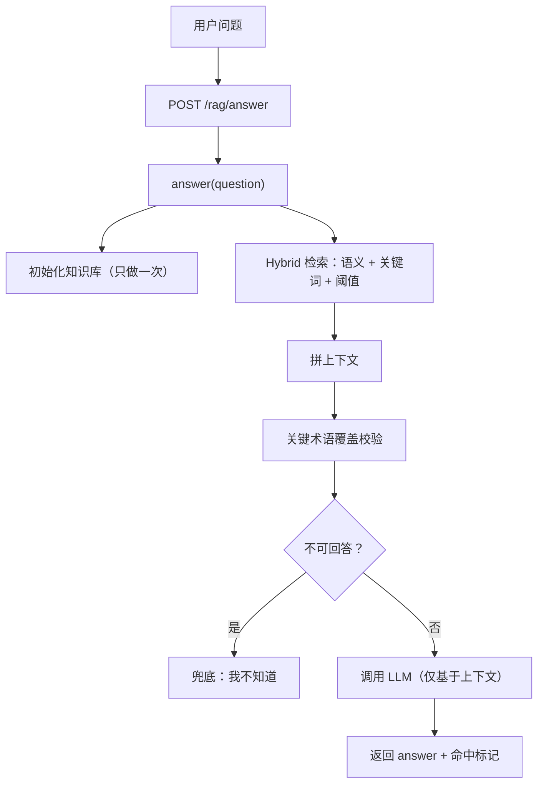

# Day 6：RAG 服务化与可观测性（从“能跑”到“能上线”）

把 RAG 从脚本升级为“可被调用、可监控、可持续优化”的后端能力。

对应可跑代码在 [src/RAG/day6/index.ts](./index.ts)。

---

## 一、目标

Day 5 解决了“能不能回答、回答准不准”。
但上线后你会遇到：

> 线上效果忽好忽坏，我该怎么调？

如果回答不了：命中文档有哪些、分数多少、谁被阈值过滤、是否触发兜底、成本耗时如何，那么这个 RAG 是不可维护的。

Day 6 的目标是：服务化 + 可观测性 + 成本直觉。

---

## 二、最小 API 与职责边界

最小 API：

```http
POST /rag/answer
{
  "question": "什么是 RAG？"
}
```

返回：

```json
{
  "answer": "……",
  "hit": true
}
```

服务层只做：接收请求 → 调用 `answer(question)` → 返回结果。
不在服务层写 RAG 逻辑、拼 prompt、调阈值。

---

## 三、服务化流程图（工程视角）



解释：Day 6 在 Day 5 的基础上，增加了“关键术语覆盖校验”，当上下文不包含问题中的关键术语时，视为不可回答并兜底。

---

## 四、日志与可观测性（必须）

必须打的四类日志：

- 检索日志：用户 query、候选分数、阈值过滤情况
- 命中日志：最终进入 prompt 的文档、命中条数
- 兜底日志：是否触发、原因（无命中/术语不覆盖/质量不足）
- 成本与耗时：embedding 次数、检索耗时、LLM 调用耗时、总耗时

最小日志示例：

```ts
console.log("[RAG][query]", question);
console.log("[RAG][timing]", { retrieveMs, llmMs, totalMs });
console.log("[RAG][cost]", { embeddingQueries, llmCalls });
console.log("[RAG][term_coverage]", { terms, covered, ratio });
console.log("[RAG][candidates]", candidatesSummary);
console.log("[RAG][final_docs]", finalDocsSummary);
console.log("[RAG][fallback]", fallback);
```

有了这些日志，就可以判定“为什么这次答得不好”。

---

## 五、命中语义的修正

将 `hit` 的语义调整为：

- 有上下文，且上下文对问题的关键术语具有覆盖；
- 否则视为不可回答，兜底并返回 `hit: false`。

关键代码要点：

```ts
const questionTerms = extractKeywords(question).slice(0, 8);
const coveredTerms = questionTerms.filter((t) => context.toLowerCase().includes(t.toLowerCase()));
const hasCriticalTerms = coveredTerms.length > 0;
const fallback = docs.length === 0 || !hasCriticalTerms;
```

注意：`hit: true` 只代表“上下文覆盖了关键术语”，不保证“足以回答（有操作细节/路径/字段解释）”。

---

## 六、成本与性能直觉

成本通常排序：Embedding > LLM 推理 > 向量检索。

工程建议：

- 文档不要频繁重新 embedding；初始化向量库尽量复用
- 缓存：文档 embedding、问题→检索结果
- 同一问题避免重复走完整流程

---

## 七、自检清单

1) 如果用户反馈“回答不准”，你第一步会看哪类日志？
2) 相似度阈值的调优依赖什么数据/分布？
3) 为什么 embedding 必须缓存或复用？
4) 为什么服务层只管 I/O，不混入 RAG 逻辑？
5) 关键术语覆盖与“可回答性”的关系是什么？

---

## 八、答案

- 问题一（回答不准，先看什么日志）：先看 `[RAG][candidates]`（候选与分数分布）、`[RAG][term_coverage]`（术语覆盖）、`[RAG][final_docs]`（最终上下文）与 `[RAG][fallback]`（是否兜底），定位是“没命中”还是“命中但不可回答”。
- 问题二（阈值如何调）：依据不同问题的相似度分布与人工验收结果；观察 `candidates → passed` 的分割效果，结合模型/语料/chunk 策略迭代，并按 embedding 模型分别设定阈值。
- 问题三（为什么缓存/复用 embedding）：Embedding 成本高且结果对静态文档稳定；缓存文档向量避免重复开销，缓存“问题→检索结果”减少高频问题的重复检索与 LLM 费用。
- 问题四（服务层不能写 RAG 逻辑）：服务层只负责 I/O 与错误处理，RAG 逻辑应在 `answer(question)` 中集中，避免耦合、便于测试与演进（阈值/检索策略/提示词独立迭代）。
- 问题五（术语覆盖与可回答性）：术语覆盖是“上下文与问题是否对齐”的必要条件，但非充分条件；还需结合“线索词/结构化要点”（如路径/字段/步骤）或引入可回答性判定，以避免“泛相关但不可回答”的命中。

---

## 九、使用示例

1. 启动服务

```bash
pnpm rag:day6
# 输出示例： [RAG] 服务已启动：http://localhost:3000/rag/answer
```

2. 通过 HTTP 请求

```bash
curl -X POST \
  -H "Content-Type: application/json" \
  -d '{"question":"什么是 RAG？"}' \
  http://localhost:3000/rag/answer
```

返回示例：

```json
{
  "answer": "……模型生成的回答……",
  "hit": true
}
```

说明：
- question：用户问题（必填）
- answer：RAG 返回的回答；当未命中知识库或术语不覆盖时会返回兜底“我不知道…”。
- hit：是否命中知识库（true 为命中且术语覆盖，false 代表兜底）。

3. 查看日志（用于调优）

运行时控制台会输出 [RAG][query]、[RAG][timing]、[RAG][candidates]、[RAG][term_coverage]、[RAG][fallback] 等字段，便于观察检索、阈值过滤、术语覆盖与兜底情况。
